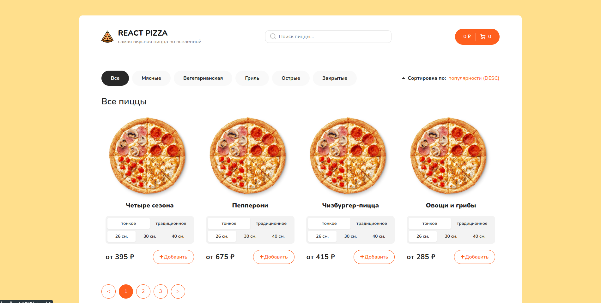
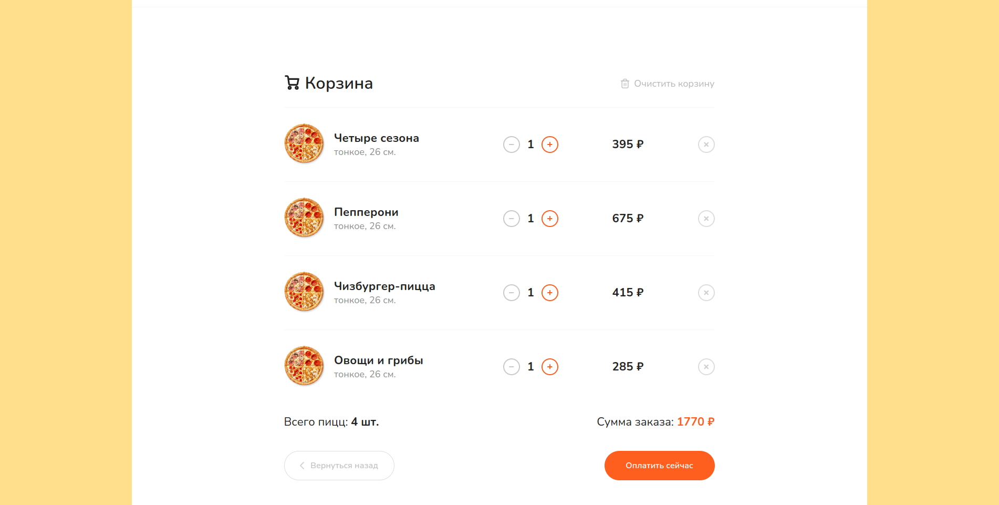
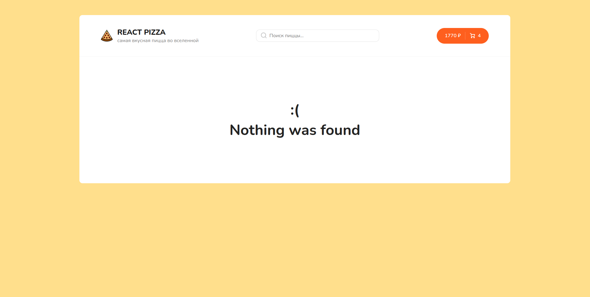

# Simple Pizza Market

This project is a simple pizza market built with React, TypeScript, and Redux Toolkit with fetch using Axios. It showcases my web developer skills and my ability to create a full-stack web application.

# Description

The Simple Pizza Market allows users to browse, order, and purchase pizzas. The website is built using React, TypeScript, and Redux Toolkit with fetch using Axios. It includes a user-friendly interface that allows customers to view pizza options, select their desired pizza, and place an order. The website also includes a shopping cart, order confirmation page, and customer account management.

The website is optimized for both desktop and mobile devices, and includes features such as real-time order tracking and notifications.

# Installation

To run this project, follow these steps:

1. Clone the repository to your computer:

## git clone https://github.com/your-username/simple-pizza-market.git

2. Install the dependencies:

## npm install

3. Start the development server:

## npm start

# Usage

To use the Simple Pizza Market, simply open the URL in a web browser. You will be taken to the homepage, where you can browse and select pizza options, add items to your cart, and proceed to checkout.

If you wish to place an order, you will need to create an account and provide your contact and delivery information. Once your order has been confirmed, you can track its delivery status through your account dashboard.

# Screenshots

# Contributing

Contributions are welcome! If you would like to contribute to this project, please fork the repository and submit a pull request with your changes.
